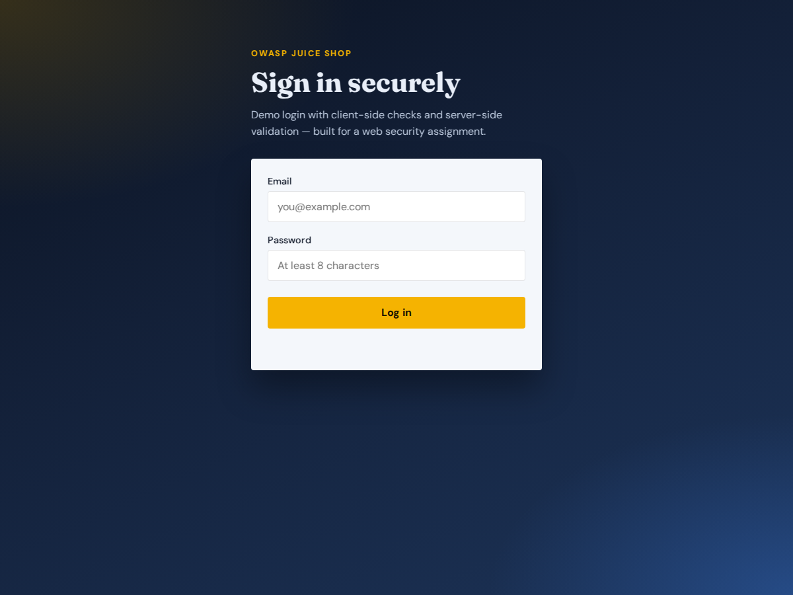
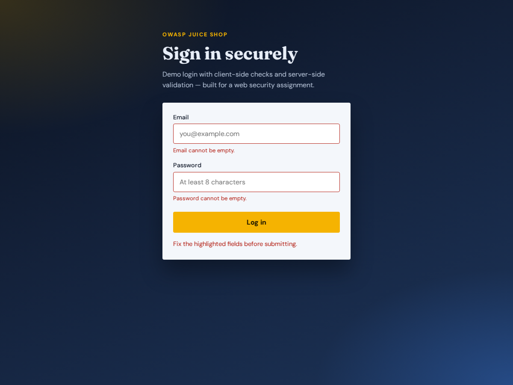
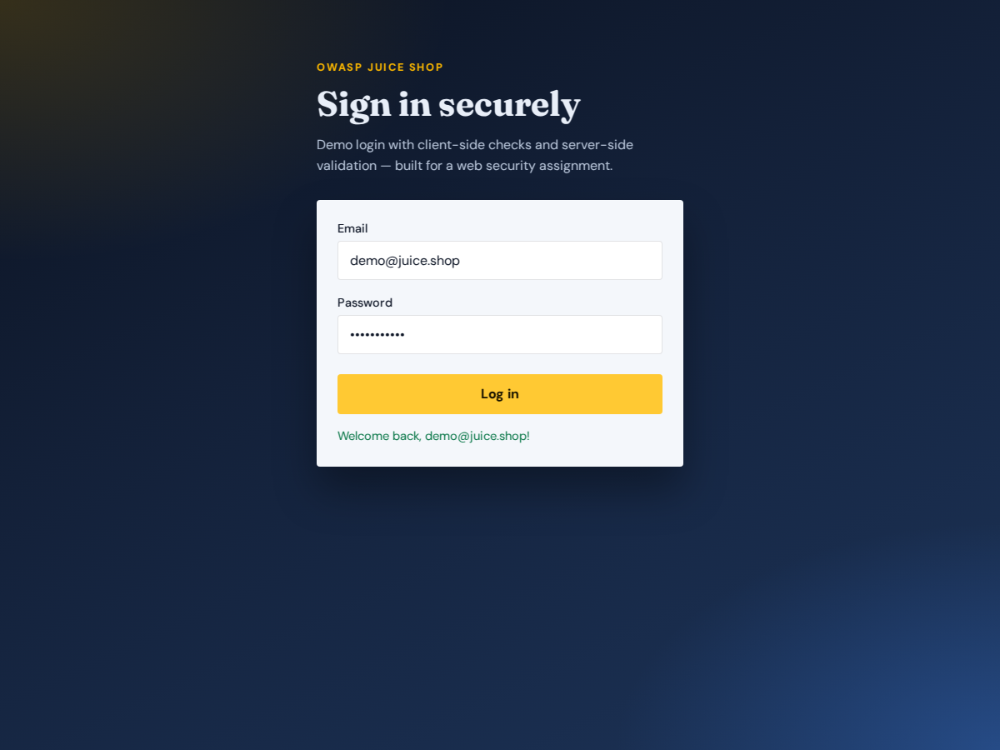
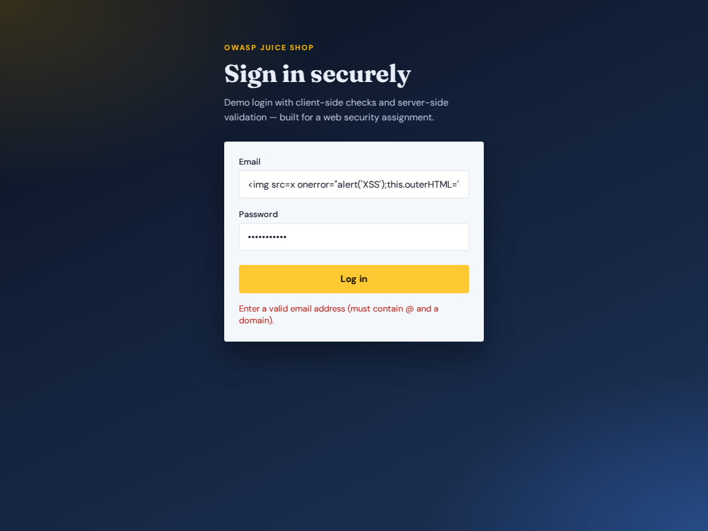
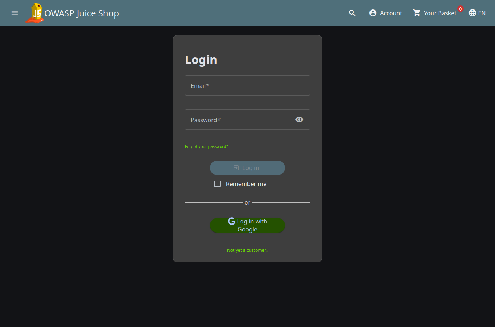
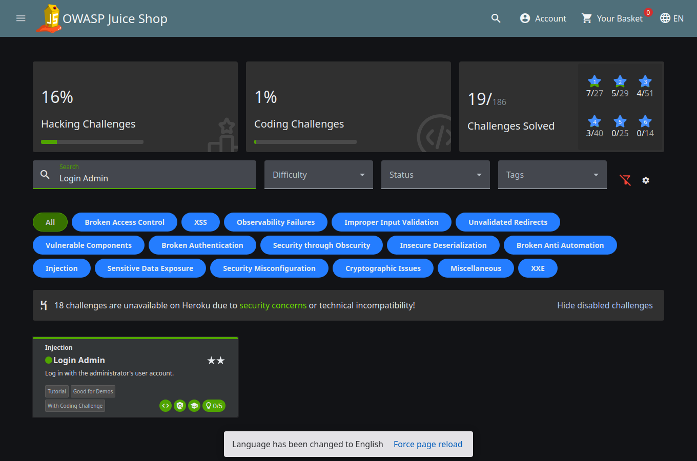

# Juice Guard

**Secure login lab inspired by [OWASP Juice Shop](https://owasp.org/www-project-juice-shop/)**

A small but serious authentication demo: HTML + JavaScript front end, Express API, bcrypt password hashing, CSRF tokens, CSP headers, and layered validation. Built for **HW 2B** (web security) and written so graders—and future you—can see *what* was secured and *why*.

[](https://nodejs.org/)
[](LICENSE)
[](https://owasp.org/)
[](https://github.com/deeps45/juice-guard)

**Live repo:** https://github.com/deeps45/juice-guard  
**Assignment PDF:** [`docs/submission.pdf`](docs/submission.pdf)

---

## Why this exists

OWASP Juice Shop is full of login and XSS traps on purpose. This project answers:

1. **What goes wrong** in Juice Shop–style auth (SQL injection on login, DOM XSS, weak JWT/session handling)?
2. **How do you build a safer form** with both client and server checks?
3. **What still breaks** if you only trust the browser—and how do you prove it?

---

## Preview

| Hardened login | Validation in action |
| --- | --- |
|  |  |
|  |  |

Juice Shop fieldwork (live instance used in the write-up):

| Juice Shop login | Score Board — Login Admin |
| --- | --- |
|  |  |

---

## Features

### Authentication & passwords
- Email + password login UI inspired by Juice Shop’s sign-in screen
- Passwords stored **only** as **bcrypt** hashes (cost factor **12**)
- Login **always** runs `bcrypt.compare` (unknown emails use a real dummy hash — no timing oracle)
- Successful login sets an httpOnly `session` cookie (`GET /api/me`)
- Generic `"Invalid email or password"` errors; register never returns **409** (no enumeration)

### Validation (defense in depth)
- **Client:** reject empty fields, require `@` in email, password length ≥ 8
- **Server:** stricter email regex, password length bounds, reject `< > ; --` style fragments
- Never trusts the browser as the security boundary

### Web attack surface hardening
- **CSRF:** `GET /api/csrf` issues a token; login requires `X-CSRF-Token` + httpOnly cookie
- **XSS:** status messages via `textContent`; server-side HTML escaping
- **CSP**, `X-Content-Type-Options`, `Referrer-Policy`, `X-Frame-Options: DENY`
- **Rate limiting** on login/register
- **No dynamic SQL** — users live in an in-memory `Map` keyed by normalized email

### Intentional vulnerable lab (Part 3 replay)
- **`/vulnerable/`** — same UI, but reflects email with `innerHTML` and **no CSP**
- Graders can reproduce a **successful XSS** with  
  ``@evil.com`` + any 8+ char password
- Hardened `/` blocks the same payload (validation + `textContent` + CSP)

### Coursework artifacts
- Full HW 2B write-up PDF with **input → observed result** Juice Shop exploits
- Replayable XSS on `/vulnerable/` plus hardened-form controls

---

## Quick start

```bash
git clone https://github.com/deeps45/juice-guard.git
cd juice-guard
npm install
npm start
```

Open **http://127.0.0.1:3847** (hardened) or **http://127.0.0.1:3847/vulnerable/** (XSS lab).

Optional custom port:

```bash
PORT=4000 npm start
```

### Demo account

Credentials are **not** shown on the login page (avoids credential stuffing of the demo UI). Use them locally from this README only:

| Field | Value |
| --- | --- |
| Email | `demo@juice.shop` |
| Password | `JuiceShop1!` |

---

## API

| Method | Path | Notes |
| --- | --- | --- |
| `GET` | `/api/health` | Liveness check |
| `GET` | `/api/csrf` | Sets `csrf_id` cookie; returns `{ csrfToken }` |
| `GET` | `/api/me` | Current session (httpOnly `session` cookie) |
| `POST` | `/api/logout` | Clears session |
| `POST` | `/api/login` | JSON `{ email, password }` + header `X-CSRF-Token` |
| `POST` | `/api/register` | Same CSRF rules; uniform success (no 409 enumeration) |
| `POST` | `/api/login-vuln` | Lab-only weak login used by `/vulnerable/` |

### Login flow

```text
Browser                         Server
   |                               |
   |-- GET /api/csrf ------------->|  set httpOnly csrf_id cookie
   |<--------- { csrfToken } ------|
   |                               |
   |-- POST /api/login ----------->|  validate CSRF
   |   X-CSRF-Token: …             |  validate email/password
   |   { email, password }         |  bcrypt.compare
   |<--------- 200 / 4xx ----------|
```

### Example (with CSRF)

```bash
# 1) Fetch CSRF token + cookie
curl -s -c cookies.txt http://127.0.0.1:3847/api/csrf
# → {"ok":true,"csrfToken":"..."}

# 2) Login (replace TOKEN)
curl -s -b cookies.txt http://127.0.0.1:3847/api/login \
  -H 'Content-Type: application/json' \
  -H 'X-CSRF-Token: TOKEN' \
  -d '{"email":"demo@juice.shop","password":"JuiceShop1!"}'
```

Without a CSRF token the API returns **403**.

---

## Project structure

```text
juice-guard/
├── public/
│   ├── index.html           # Hardened login UI
│   ├── app.js               # Client validation + CSRF + textContent
│   ├── styles.css
│   └── vulnerable/          # Intentional XSS lab (innerHTML, no CSP)
│       ├── index.html
│       └── app.js
├── server.js                # Express API, bcrypt, CSRF, CSP, sessions
├── docs/
│   ├── submission.pdf       # HW 2B submission (submit this)
│   └── screenshots/         # Juice Shop exploits + form evidence
├── scripts/
│   ├── capture-form-exploits.js
│   ├── capture-juice-exploits.js
│   └── generate-submission-pdf.py
├── package.json
└── README.md
```

---

## Security model (short)

| Threat | Control in this repo |
| --- | --- |
| SQL injection on login | No string-built SQL; Map lookup by email |
| XSS via reflected status | `textContent` + `escapeHtml` + CSP on `/` |
| CSRF on login/register | Double-submit style CSRF cookie + header |
| Stolen password DB | bcrypt cost 12 |
| Account timing / enum | Dummy bcrypt hash + uniform register response |
| Brute force | `express-rate-limit` |
| Clickjacking | `X-Frame-Options: DENY` |
| Blind trust in browser | Server re-validates everything |

**Part 3:** a **successful** XSS is replayable on `/vulnerable/` (`innerHTML` sink). The hardened `/` shows why `textContent` + CSP stop the same payload. Client checks alone are still not a security boundary.

---

## Assignment map (HW 2B · 60 pts)

| Criterion | Where to look |
| --- | --- |
| **1. Identification (20)** | Juice Shop screenshots + measures in [`docs/submission.pdf`](docs/submission.pdf) |
| **2. Secure form (20)** | `public/*` + `server.js` + this README |
| **3. Exploit docs (20)** | Organized tests + figures in the PDF / `docs/screenshots/` |

Named Juice Shop challenges referenced in the write-up:

- **Login Admin** (Injection)
- **DOM XSS** (XSS)
- **Forged Signed JWT** / broken-authentication class

---

## Scripts

| Command | Purpose |
| --- | --- |
| `npm start` | Run the secure login server (port **3847**) |
| `npm run dev` | Same as start (simple Node process) |
| `node scripts/capture-screenshots.js` | Refresh UI evidence (needs Playwright installed locally) |
| `python3 scripts/generate-submission-pdf.py` | Rebuild `docs/submission.pdf` |

---

## Tech stack

- **Runtime:** Node.js 18+
- **Server:** Express
- **Crypto:** bcryptjs
- **CSRF helpers:** cookie-parser + in-memory token store
- **Hardening:** express-rate-limit, CSP and related headers
- **Front end:** plain HTML / CSS / JS (no framework lock-in)

---

## Disclaimer

This is an **educational** authentication demo for coursework. It uses an in-memory user store and is **not** a production identity provider. Do not deploy it as-is to the public internet without a real database, TLS, secrets management, and a full threat review.

OWASP Juice Shop screenshots in `docs/screenshots/js-*` were captured from the public preview instance for assignment evidence.

---

## Author

**Siva Sai Deepank Manoj** · `deeps45@tamu.edu`

---

## License

MIT — see [`LICENSE`](LICENSE) if present, otherwise use freely for academic purposes with attribution appreciated.
